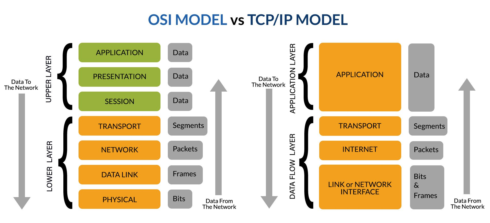

# OSI Model vs TCP/IP Model

### OSI Model (7 Layers)

    Application – User interface

    Presentation – Data formatting & encryption

    Session – Connection management

    Transport – Reliable transmission

    Network – Routing, IP addressing

    Data Link – MAC addressing, frame traffic

    Physical – Electrical signals, cables

### TCP/IP Model (4 Layers)

    Application – Combines OSI layers 5-7 (HTTP, SMTP, DNS)

    Transport – Data delivery  (TCP, UDP)

    Internet – Logical addressing (IP, ICMP)

    Network Access – Physical delivery  (Ethernet, ARP)
# poc

### Mapping OSI ↔ TCP/IP:

    OSI 7–5 = TCP/IP Application

    OSI 4 = TCP/IP Transport

    OSI 3 = TCP/IP Internet

    OSI 2–1 = TCP/IP Network Access

### Ports

| Port  | Protocol | Description             |
| ----- | -------- | ----------------------- |
| 20/21 | FTP      | File Transfer           |
| 22    | SSH      | Secure Shell            |
| 23    | Telnet   | Remote Login (insecure) |
| 25    | SMTP     | Email Sending           |
| 53    | DNS      | Domain Resolution       |
| 80    | HTTP     | Web Traffic             |
| 443   | HTTPS    | Secure Web Traffic      |
| 110   | POP3     | Incoming Email          |
| 139   | NetBIOS  | Windows File Sharing    |
| 445   | SMB      | Windows Network Sharing |
| 3389  | RDP      | Remote Desktop          |

### Common Protocols

    TCP (Transmission Control Protocol)
    Reliable, connection-oriented (e.g., HTTP, FTP)

    UDP (User Datagram Protocol)
    Fast, connectionless (e.g., DNS, VoIP)

    IP (Internet Protocol)
    Logical addressing, packet forwarding

    ICMP (Internet Control Message Protocol)
    Diagnostics (ping, traceroute)

    ARP (Address Resolution Protocol)
    Maps IP ↔ MAC addresses

    DNS (Domain Name System)
    Resolves domain names to IPs

## References:
https://www.rtautomation.com/rtas-blog/a-refresher-course-on-osi-tcp-ip/?srsltid=AfmBOoon4OBECotTODr7aB5z9RQPgReG1EkF4QwrwgvqUB7keQiEzD7u